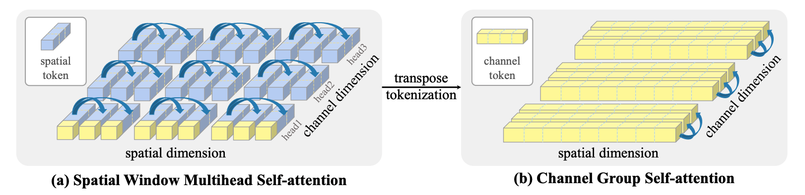
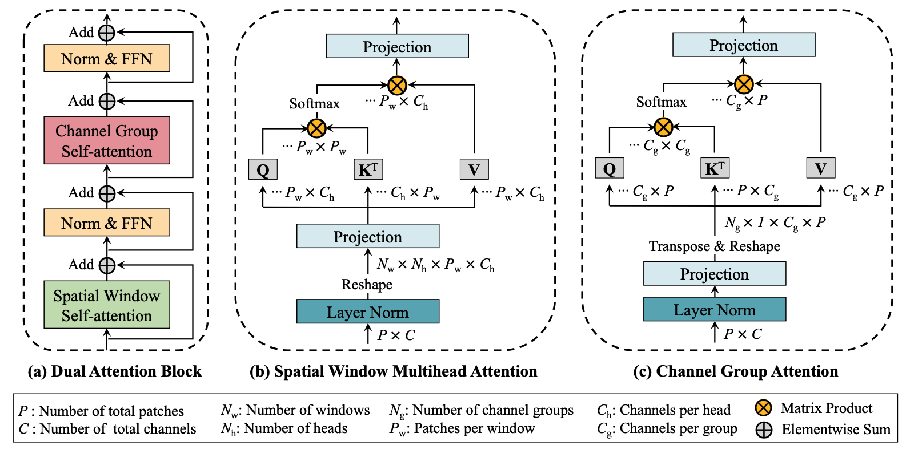
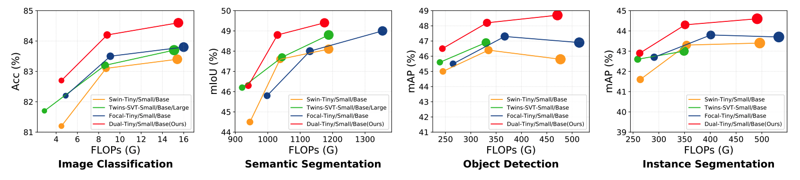

## Introduction

In this work, we introduce Dual Attention Vision Transformers (DaViT), a simple yet effective vision transformer architecture that is able to capture global context while maintaining computational efficiency.
We propose approaching the problem from an orthogonal angle: exploiting self-attention mechanisms with both "spatial tokens" and "channel tokens".
(i) Since each channel token contains an abstract representation of the entire image, the channel attention naturally captures global interactions and representations by taking all spatial positions into account when computing attention scores between channels.
(ii) The spatial attention refines the local representations by performing fine-grained interactions across spatial locations, which in turn helps the global information modeling in channel attention.

Extensive experiments show our DaViT achieves state-of-the-art performance on four different tasks with efficient computations.
Without extra data, DaViT-Tiny, DaViT-Small, and DaViT-Base achieve 82.8%, 84.2%, and 84.6% top-1 accuracy on ImageNet-1K with 28.3M, 49.7M, and 87.9M parameters, respectively.
When we further scale up DaViT with 1.5B weakly supervised image and text pairs, DaViT-Gaint reaches 90.4% top-1 accuracy on ImageNet-1K.

